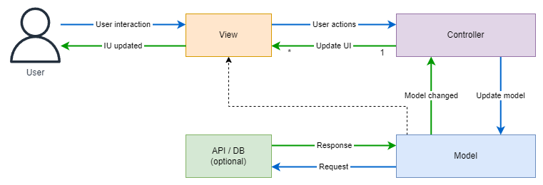
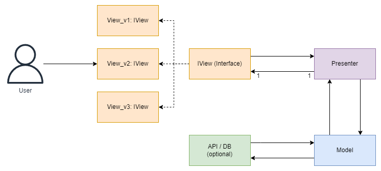

# Architectures MVC, MVP and MVVM<!-- omit in toc -->

## Contents <!-- omit in toc -->

- [1. Introduction](#1-introduction)
  - [1.1. MVC (Model-View-Controller):](#11-mvc-model-view-controller)
  - [1.2. MVP (Model-View-Presenter):](#12-mvp-model-view-presenter)
  - [1.3. MVVM (Model-View-ViewModel):](#13-mvvm-model-view-viewmodel)
- [2. Conclusion](#2-conclusion)
- [3. Pattern comparison](#3-pattern-comparison)
- [4. References](#4-references)

# 1. Introduction

- MVC, MVP, and MVVM are all popular architectural patterns used in software development to separate the concerns of an application and promote code organization, reusability, and maintainability.

## 1.1. MVC (Model-View-Controller):

- **Model:** Represents the data and business logic of the application.
- **View:** Displays the user interface and interacts with the user.
- **Controller:** Mediates between the Model and the View, handling user input, updating the Model, and updating the View accordingly.
  - One to one relationship between View and Controller.
- In MVC, the Model and View are usually decoupled, with the Controller acting as an intermediary.
  - The View observes the Model for changes and updates itself accordingly.
    

## 1.2. MVP (Model-View-Presenter):

- **Model:** Similar to MVC, it represents the data and business logic.
- **View:** The user interface layer responsible for displaying information and capturing user input.
  - View to that basically handles the information in a different way, but it implements the **Interface**.
- **Presenter:** Acts as an intermediary between the Model and the View.
  - It retrieves data from the Model and updates the View based on the user interactions.
- Unlike MVC, the presenter in MVP takes on more responsibilities and handles the user input directly, making the View passive.
- RECOMENDATION: Don't use more than 15 IU (Views).

  

## 1.3. MVVM (Model-View-ViewModel):

- **Model:** Represents the data and business logic, similar to the previous patterns.
- **View:** The user interface layer responsible for displaying information and capturing user input.
- **ViewModel:** The intermediary between the Model and the View. It exposes data and commands that the View can bind to.
  - The ViewModel also notifies the View of any changes in the underlying data.
- MVVM promotes two-way data binding between the View and the ViewModel, allowing automatic propagation of data changes.
- 

# 2. Conclusion

- All three patterns aim to separate concerns, but they differ in the level of responsibility assigned to each component and the way they handle user interactions and data binding.
- MVC and MVP are older patterns, while MVVM gained popularity with the rise of frameworks like WPF (Windows Presentation Foundation) and AngularJS.
- It's important to note that the descriptions provided here are simplified, and in practice, variations and adaptations of these patterns can exist depending on the specific technologies and frameworks used.

# 3. Pattern comparison

# 4. References

- [GUI Architectures - Martin Fowler](https://www.martinfowler.com/eaaDev/uiArchs.html)
